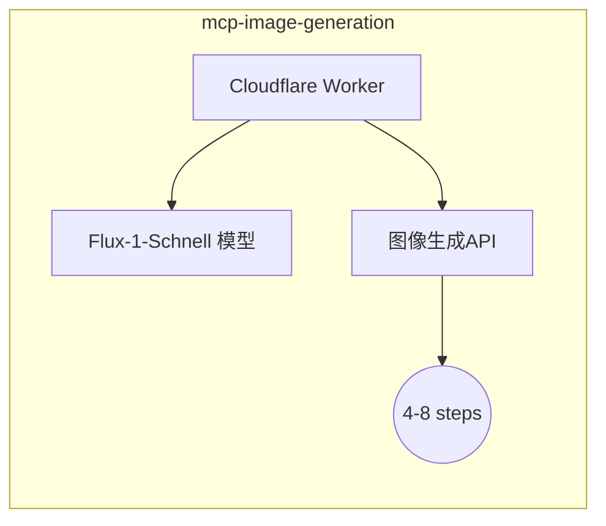

# CF-MCP-Server

[](https://opensource.org/licenses/MIT)


基于 Model Context Protocol (MCP) 的图像生成服务实现，采用 Cloudflare Workers 构建。

## 核心功能

- 🖼️ 基于 MCP 协议的标准化服务接口
- 🚀 开箱即用的图像生成 Worker 模块
- 🔧 支持快速扩展自定义工具和资源
- ⚡ 边缘计算优化部署

## 模块构成

### mcp-image-generation


- 支持步骤数范围：4-8 steps
- 响应格式：Base64 编码的 PNG 图像
- 部署方式：Cloudflare Workers

## 快速开始

### 环境要求
- Node.js 18+
- Wrangler CLI
- NPM

### 安装部署
```bash
# 安装依赖
pnpm install

# 配置环境变量
cp .env.example .env

# 部署Worker
pnpm deploy
```

## API 文档

### 图像生成接口
**配置示例**:
```json
{
  "mcpServers": {
    "generateImage": {
      "command": "/Users/zhangxudong/Gits/turinhub/cf-mcp-server/mcp-image-generation/node_modules/.bin/workers-mcp",
      "args": [
        "run",
        "generateImage",
        "https://mcp-image-generation.turinhub.com",
        "/Users/zhangxudong/Gits/turinhub/cf-mcp-server/mcp-image-generation"
      ],
      "env": {}
    }
  }
}
```

**参数说明**:
| 参数   | 类型   | 约束          | 说明             |
|--------|--------|--------------|------------------|
| prompt | string | 1-500字符     | 英文描述提示词    |
| steps  | number | 4 ≤ steps ≤ 8 | 生成迭代步数     |

## 开发指南

### 添加新工具
[参考在线文档](https://developers.cloudflare.com/agents/examples/build-mcp-server/)
[官方案例代码库](https://github.com/cloudflare/workers-mcp/tree/main)

1. 使用 MCP SDK 创建新 Worker：
```bash
npx create-cloudflare@latest my-new-worker
cd my-new-worker # I always forget this bit
npm install workers-mcp
npx workers-mcp setup
```
2. 实现工具逻辑后更新主服务配置

## 贡献说明
欢迎通过 Issue 和 PR 参与贡献，请遵循现有代码风格。

## 许可证
MIT License © 2025 Turinhub
